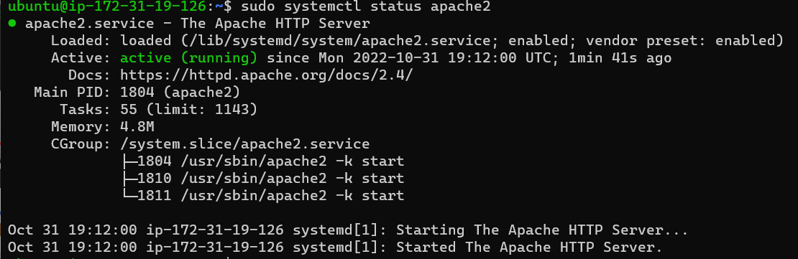

## Awesome Documentation of Project-A

`sudo apt update`

`sudo apt install apache2`

`sudo systemctl status apache2`

- [install openssh](https://learn.microsoft.com/en-us/windows-server/administration/openssh/openssh_install_firstuse?tabs=gui)

- [openssh-key management](https://learn.microsoft.com/en-us/windows-server/administration/openssh/openssh_keymanagement)