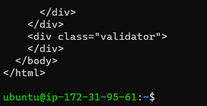
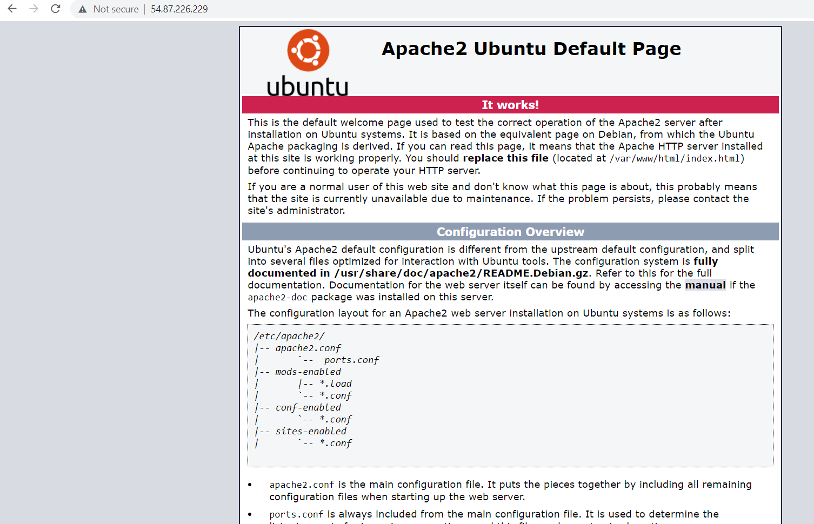

# Documentation of Project-one

## Update a list of packages in package manager
`sudo apt update`

## Run apache2 package installation
`sudo apt install apache2`

## To verify Apache2 running status
`sudo systemctl status apache2`

## Accessing webserver from Ubuntu shell
`curl http://localhost:80`

## Accessing webserver over the internet
`http://54.87.226.229:80`

[Apache2 Ubuntu Default Page](http://54.87.226.229:80)

- [install openssh](https://learn.microsoft.com/en-us/windows-server/administration/openssh/openssh_install_firstuse?tabs=gui)

- [openssh-key management](https://learn.microsoft.com/en-us/windows-server/administration/openssh/openssh_keymanagement)